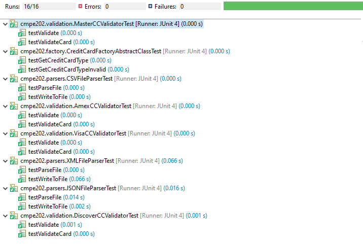

# Individual-Project-ANANTHUPADHYA

## Credit Card Problem

This application accepts two arguments one the sampleInput file and another argument as the sampleOutput file name.

The java program accepts 3 types of files json/xml/csv file formats and reads the data from the specified file.

The program reads the card account number and then validates if the card is the valid card number or not, identifies which type of card
is it based on the card number (American Express, Master Card, Visa or Discover). These cards are identified by the pattern from the card number.

The program will give an error if the it is not a valid card number. 
The card will then be read and an output file in the same format as the input - (json or xml or csv) will be generated,
with each line showing the card number, type of card (if a valid card number) and an error (if the card number is not valid). 

### Running the program

We can run the program using cli, ide or through jar files
### Installing Dependencies:- 
a) Install Maven
b) mvn install

### Cli :- 

Compile the java code : javac MainClass.java
Run the complied code java MainCalss <inputFilePath> <outputFilePath>

### Ide :- 
Run the MainClass.java file with two arguments (inputFile and outputFile name) in the Run Configuration

### Jar :- 
Run the jar file giving two arguments

 Unit tests: -
  Wrote JUnit tests with a coverage of >80 percent. Sample screenshot of the same
  
 
